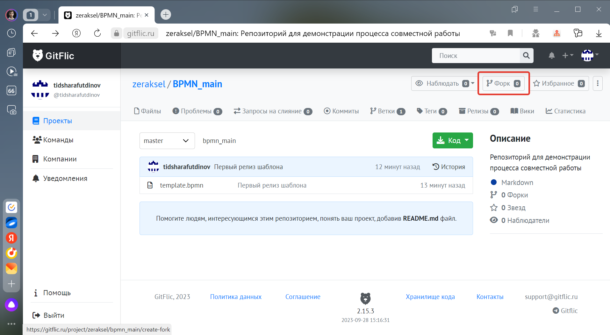
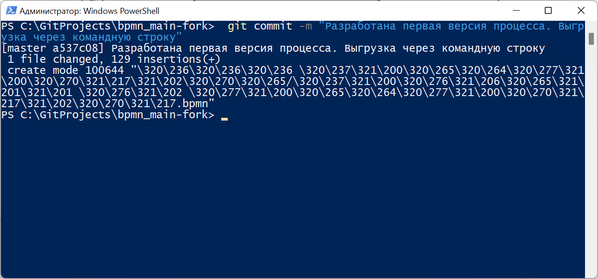
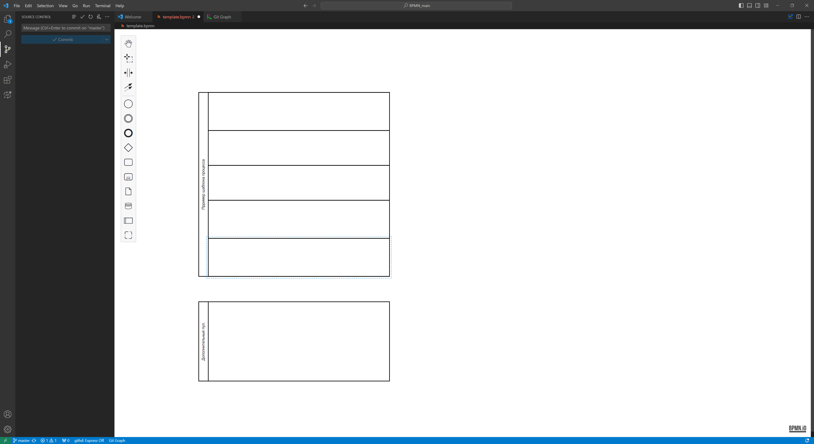

# Инструкция по установке инструментов, описанию и выгрузке бизнес-процессов

Данная инструкция предназначена для участников рабочей группы проекта по описанию сквозного процесса жизненного цикла объекта капитального строительства и модели данных объекта капитального строительства в целях унификации инструментов, форматов и подходов к разработке бизнес процессов.

## Содержание

1. [Установка инструментов для моделирования бизнес-процессов](#установка-инструментов-для-моделирования-бизнес-процессов)
2. [Общее описание функций инструмента для моделирования бизнес-процессов](#описание-функционала-bpmnio)
3. [Требования к нотации для описания бизнес-процессов](#правила-оформления-моделей-бизнес-процессов)
4. [Проверка корректности с использованием инструментов симуляции](#проверка-корректности-с-использованием-инструментов-симуляции)
5. [Слияние моделей бизнес-процессов в общий репозиторий с использованием Git](#слияние-моделей-бизнес-процессов-с-общим-репозиторием-с-использованием-git)

## Установка инструментов для моделирования бизнес-процессов

Для работы по описанию бизнес процессов потребуется персональный компьютер с доступом в сеть интернет, для которого потребуется установка следующих приложений:

1. [Microsoft Visual Studio (или VSC)](#установка-microsoft-visual-studio-code-vsc) - бесплатный редактор кода
2. [Надстройка (плагин) к VSC - BPMN.io](#установка-плагина-bpmnio), для описания бизнес-процессов
3. [Приложение Git](#установка-приложения-git) - для контроля версий и передачи в общий репозиторий
4. [Camunda Modeller](#camunda-modeller---альтернатива-vsc--bpmnio) - приложение для описания бизнес процессов (по желанию, как альтернатива VSC + BPMN.io)

> Описываемые в настоящей инструкции шаги выполняются на примере работы с операционной системой Windows, как наиболее распространенной. Установка представленных инструментов на операционные системы Linux допускается, однако в настоящей инструкции отдельно не рассматривается.

### Установка Microsoft Visual Studio Code (VSC)

**Microsoft Visual Studio Code** является бесплатным приложением, разработанным компанией Microsoft, для работы с программным кодом и преимущественно для разработчиков программного обеспечения. Однако наличие в нем большой библиотеки расширений позволяет значительно расширить возможности использования, в том числе для специалистов широкого профиля.
Для установки VSC необходимо перейти в раздел **Download** на [официальном сайте программы](https://code.visualstudio.com/Download) и скачать подходящую для вашей операционной системы версию.


После завершения скачивания программу необходимо установить.

> Для установки приложений вам потребуются права администратора.

В процессе установки программы, необходимо убедиться, что отмечен пункт *"Добавить в PATH"*. Остальные параметры отмечаются по необходимости.


После установки рекомендуется перезагрузить ПК в целях обновления системной информации и корректной работы программы.
Запуск программы осуществляется с ярлыка на рабочем столе или из перечня программ в меню "Пуск".


### Git в Visual Studio Code

Visual Studio Code имеет встроенную поддержку Git. Вам потребуется установить Git версии не ниже чем 2.0.0.

Основные особенности:

* Просмотр изменений редактируемого файла
* Панель состояния Git (слева внизу), на которой отображается текущая ветка, индикатор ошибок, входящие и исходящие коммиты.
* В редакторе можно делать основные Git операции:

  * Инициализация репозитория.
  * Клонирование репозитория.
  * Создание веток и тегов.
  * Индексация изменений и создание коммитов.
  * Push/pull/sync с удалённой веткой.
  * Разрешение конфликтов слияния.
  * Просмотр изменений.

### Установка плагина BPMN.io

**BPMN.io** - проект свободно распространяемых графических инструментов для моделирования различного типа моделей и схем (BPMN, DMN и др.). Используется в качестве основного движка в системе управления бизнес-процессов Camunda. Его графическая подсистема **bpmn-js** может встраиваться в любые виды настольных (десктоп) и веб-приложений. но также встречается и в виде надстроек для программ, в том числе для Microsoft VSC.
Главным преимуществом использования bpmn-js, как плагина к VSC, является возможность правки схемы непосредственно в коде модели бизнес-процесса, т.к. описание происходит на языке разметки XML. Это позволяет расширить недоступный функционал при моделировании бизнес-процессов.
Подробнее о проекте BPMN.io вы можете узнать на его [официальном сайте](https://bpmn.io/).

> В настоящей инструкции под BPMN.io подразумевается графическая подсистема **bpmn-js** для работы с бизнес-процессами нотации BPMN 2.0


Для установки плагина BPMN.io на VSC необходимо сделать следующее:

1. В левой панели VSC выбрать раздел "Extensions" (или нажать на комбинацию клавиш Ctrl+Shift+X)
2. В появившемся блоке в верхнем поле "Search Extensions in Marketplace" необходимо ввести `bpmn.io Editor`
3. Из найденных вариантов выбрать BPMN.io Editor, где в правом углу необходимо выбрать команду "Install" для установки плагина


### Установка плагина **Git Graph**

Расширение [Git Graph](https://marketplace.visualstudio.com/items?itemName=mhutchie.git-graph) позволяет просматривать структуру репозитория и, пользуясь этой структурой, выполнять различные операции. Это расширение поддаётся тонкой настройкой и обладает множеством возможностей. Вероятно, для того, чтобы как следует его описать, понадобится целая отдельная статья.


Для установки плагина Git Graph на VSC необходимо сделать следующее:

1. В левой панели VSC выбрать раздел "Extensions" (или нажать на комбинацию клавиш Ctrl+Shift+X)
2. В появившемся блоке в верхнем поле "Search Extensions in Marketplace" необходимо ввести `Git Graph`
3. Из найденных вариантов выбрать Git Graph, где в правом углу необходимо выбрать команду "Install" для установки плагина

### Установка приложения GIT

**GIT** - система контроля версий программного кода. Повсеместно используется командами разработчиков по всему миру для совместной разработки программного обеспечения. Позволяет отслеживать изменения, контролировать ход разработки и при необходимости возвращаться к предыдущим версиям кода.

> Важно знать о разнице между **Git** и **GitHub (GitFlic)**: Git - это программа, устанавливаемая на компьютер, и работающая с локальным репозиторием (т.е. директорией, в которой вы храните код и файлы), а GitHub, или его отечественный аналог GitFlic - это удаленный репозиторий для возможности совместной работы удаленных команд. Именно через удаленный репозиторий происходит информацией между участниками проекта. Работа на удаленном репозитории без Git, установленном на вашем компьютере, невозможна.

Для обмена информацией при разработке бизнес-процессов будет использоваться удаленный репозиторий на отечественной платформе **GitFlic**. О процессе работы с удалённым репозиторием описано [в соответствующем разделе](#слияние-моделей-бизнес-процессов-с-общим-репозиторием-с-использованием-git) данной инструкции. Однако, для работы с ним, обязательно необходимо скачать и установить само приложение Git. Для этого необходимо перейти на [официальный сайт приложения](https://git-scm.com/downloads "Git") и скачать подходящую для вашей ОС версию.


В процессе установки система будет запрашивать множество настроек. При отсутствии соответствующей необходимости, следует оставить эти настройки по умолчанию, нажимая только кнопку "Next" (далее) вплоть до завершения процесса установки.


GIT - приложение преимущественно консольное, т.е. основным элементом его управления является командная строка (терминал). Поэтому для того, чтобы убедиться, что GIT установлен, достаточно открыть командную строку (Win+R и ввести "cmd"), ввести команду

```
git --version
```

Если ответом будет

```
git version 2.42.0.windows.2
```

это означает, что программа установлена корректно (версия может отличаться, но главное, что она отображается).


Также на этом шаге обязательно необходимо указать свои данные, введя в командную строку последовательно две команды. Сначала

```
git config --global user.email "you@example.com"
```

 а затем

```
git config --global user.name "Your Name"
```

где значения `you@example.com` и `Your Name` необходимо заменить соответственно на реальные почту и имя пользователя, от имени которых будет затем осуществляться выгрузка в репозиторий.

### Настройка VSC для работы с BPMN.io

Для того, чтобы работать в BPMN.io внутри Visual Studio Code, необходимо

1. Выбрать меню File -> Open Folder и в открывшемся окне выбрать папку, в которой будет храниться свой файл бизнес-процесса. Для примера это будет папка с именем **bpmn_test**

> В данную папку будет клонирован репозиторий с GitFlic, откуда нужно взять шаблон для разработки бизнес-процесса, поэтому в примере в выбранной папке уже есть файл. Подробнее описано [в соответствующем разделе](#открытие-клонированной-папки-форка-в-vsc) инструкции.

После того, как папка выбрана, может появиться окошко с предупреждением о том, что данная папка не является доверенной, в связи с чем необходимо подтвердить, что вы ей доверяете, нажав на команду *"Yes, I trust the authors" (Да, я доверяю авторам).*


2. Далее нужно перейти в раздел Explorer в левой части окна программы и навести на строку с именем только что открывшейся папки, в результате чего появятся скрытые кнопки, и выбрать соответствующую кнопку в интерфейсе. Например, создать папку, где будет вестись ваша схема процесса и дать ей имя, соответствующее, например, имени вашей компании.


3. Теперь необходимо скопировать шаблон файла бизнес-процесса в вашу папку. Это можно сделать как стандартными средствами в окне проводника, так и в том же окне VSC, вызвав контекстное меню по шаблону и выбрав команду "Copy", а затем, выбрав новую папку, и вызвав контекстное меню, выбрать команду "Paste". При необходимости только что созданную копию можно переименовать, выбрав в контекстном меню команду "Rename...".


4. После того, как копия создана, нажмите на неё. В основном окне программы откроется графический редактор **BPMN.io**, в котором будет происходить основная работа по описанию бизнес-процесса.


5. Для удобства редактирования можно параллельно с графическим интерфейсом открыть тот же файл в текстовой форме. Для этого необходимо:

   1. Нажать правой кнопкой мыши по вкладке открытого файла и выбрать команду "Reopen Editor With", и в появившемся меню выбрать команду "Text Editor".

   

   2. Теперь необходимо выбрать команду "Split Editor Right" в правой верхней части окна, что позволит разделить окно на две части.

   

   3. Снова нажать правой кнопкой мыши по вкладке, например слева, выбрать команду "Reopen Editor With", и в появившемся окне меню выбрать команду "BPMN Modeller". В результате отобразится 2 вкладки с одним и тем же файлом, но в разных формах отображения.

   

> Для того, чтобы изменения отражались в соседнем окне, необходимо сохранять файл, используя, например, комбинации клавиш Ctrl+S. При сохранении файла, все изменения тут же отобразятся в его текстовом представлении (правая вкладка).

#### Для чего использовать код (текстовое представление)?

Самый простой пример - изменение размеров графических элементов. По умолчанию графические инструменты bpmn.io не дают возможности растянуть некоторые элементы, например блоки действий (Activities). Из-за этого невозможно уменьшить или увеличить блоки действий. Однако, если найти данный элемент в текстовом представлении и изменить параметры его размеров (width - ширина и height - высота), в графическом представлении элемент также изменит значение.


### Camunda Modeller - альтернатива VSC + BPMN.io

Если по какой-либо причине установить VSC в связке с плагином bpmn.io невозможно, можно использовать бесплатное десктопное приложение "Camunda modeller", которое можно скачать с [официального сайта](https://camunda.com/download/modeler/) приложения.


После установки, приложение будет доступно из меню Пуск по имени "Camunda Modeller". Открыв приложение и открыв в нем схему bpmn, можно использовать те же самые инструменты для описания бизнес-процесса.


> При необходимости отредактировать код, нажмите на команду "XML" в левом нижнем углу окна. Активируется режим работы с кодом.

## Описание функционала bpmn.io

> **ВНИМАНИЕ**
>
> Настоящее описание не является полноценным исчерпывающим руководством, однако достаточно для того, чтобы ознакомиться с основными функциями для моделирования бизнес-процессов в BPMN.io

### Общий обзор интерфейса

Основными элементами интерфейса в графическом редакторе описания бизнес-процессов BPMN.io являются:

* **рабочая область** - в ней размещается сама схема (модель) бизнес-процесса
* **панель инструментов** - в ней размещаются необходимые для работы инструменты: панорамирования, группового выделения, растягивания схемы, а также все основные элементы нотации BPMN 2.0.


### Описание инструментов

#### Рука

**Рука** используется при необходимости перемещения в плоскости рабочей области (панорамирования). Для этого необходимо выбрать инструмент и зажав левую кнопку мыши перемещать в стороны.


#### Групповое выделение

Групповое выделение элементов позволяет выбрать все или часть элементов схемы для того, чтобы, например, сдвинуть их. Для этого выбрав инструмент, нужно зажав левой кнопкой мыши создать область, в которую попадут выбираемые элементы. После чего можно, например, их переместить.


#### Растяжение схемы

Использование инструмента растяжения позволяет растягивать или сжимать всю рабочую область по горизонтали или вертикали. Это может быть полезно, когда необходимо увеличить место для добавления новых элементов, или напротив - для сокращения занимаемого места. Для этого необходимо выбрать инструмент, навести на место в рабочей области, где будет происходить растяжение/сжатие, а затем, зажав левую кнопку мыши, переместить в нужную сторону.


#### Добавление потоков

Использование инструмента потока (изображается в виде стрелок) позволяет соединять два отдельных элемента. Возможно два метода: при выборе из панели инструментов и при всплывающем меню у элемента. В первом случае нужно выбрать инструмент на панели, выбрать первый элемент, а затем второй. Во втором случае, необходимо выбрать первый элемент и во всплывающем меню выбрать иконку с потоками и уже затем выбрать соединяемый элемент.


#### Изменение потоков

Потоки, размещаемые на схеме, можно изменять, используя маркеры параллельного перемещения (расположены на линиях потоков) и маркеры свободного перемещения (расположены на краях потоков).


#### Копирование и вставка элементов

При необходимости скопировать элементы схемы, следует использовать комбинацию горячих клавиш: Ctrl+C (копировать) и Ctrl+V (вставить).


> Данный способ работает только в пределах одного файла модели бизнес-процесса. Скопировать в одном, а потом вставить в другой файл не получится.
>
> В Camunda Modeller данный способ недоступен.

#### Размещение элементов схемы

Для того, чтобы разместить элемент на схеме, следует воспользоваться одним из двух методов:

1) Нажатием на команду на панели инструментов: при нажатии на иконку команды и выбором места в рабочей области
2) Нажатием на команду из всплывающего меню на элементе выбрать элемент, создаваемый в потоке за выбранным.


#### Изменение текста элементов

Для добавления текста к элементу следует щелкнуть по нему двойным щелчком мыши. Активируется текстовое поле, вводится текст и подтверждается нажатием на *Enter* с клавиатуры.


#### Изменение типов элементов

Изменить тип элементов можно выбрав элемент и во всплывающем меню нажав (при наличии) на команду с иконкой гаечного ключа. В раскрывшемся меню можно выбрать новый тип элемента.


#### Удаление элементов схемы

Для удаления выбранных элементов необходимо выбрать иконку корзины на всплывающем меню выбранного элемента, либо нажатием на клавишу Delete с клавиатуры.


#### Вставка элементов в поток

При необходимости вставить дополнительный элемент между другими, если они уже объединены потоком, необходимо выбрать элемент (например из панели инструментов) и поставить его поверх потока.


#### Изменение цвета элементов

Для того, чтобы изменить цвет любого элемента, необходимо выбрать элемент и во всплывающем меню нажать на команду с иконкой кисточки. В выпадающем меню выбрать подходящий цвет.


#### Добавление комментариев

Для добавления комментария он должен быть привязан к одному из элементов. Для этого выбирается элемент и во всплывающем меню выбирается команда с иконкой обозначения комментария. После чего посредством функции [изменения текста](#изменение-текста-элементов) добавляется комментарий, а затем размещается в удобном положении.


#### Пулы, дорожки и операции с ними

Для добавления пула необходимо выбрать соответствующую команду на панели инструментов. Пул можно разделять, добавлять новые дорожки и изменять их заголовки. Кроме того, пул может быть разделен таким образом, что он будет, как встроенный (пул нижнего уровня.) Для этого необходимо выбрать не сам пул, а дорожку, которую при разделении станет встроенным пулом.


#### Группы

Для использования групп достаточно выбрать соответствующий инструмент на панели и установить в рабочей области. Затем, используя маркеры растяжения, выровнять размеры и разместить в удобном месте. Двойным щелчком мыши можно изменить заголовок группы.


# Правила оформления моделей бизнес-процессов

Настоящий раздел определяет правила, которых необходимо придерживаться при разработке моделей бизнес-процессов.

### Нотация BPMN 2.0

Основным "языком" описания бизнес-процессов для целей проекта является система условных обозначения (нотация) BPMN версии 2.0. Данная нотация разрабатывается и поддерживается консорциумом [Object Management Group](https://www.omg.org/). На официальном [сайте нотации BPMN](https://www.bpmn.org/) есть официальное англоязычное руководство, примеры моделей процессов и другие полезные сведения.

Тем не менее, существует большое количество русскоязычных источников, которые можно использовать для изучения работе с BPMN. Вы можете найти их, используя любую поисковую систему, вот лишь некоторые из них:

* Справочник по BPMN 2.0 - [https://camundarus.ru/bpmn/reference](https://camundarus.ru/bpmn/reference)
* Справочник элементов BPMN с примерами - [https://stormbpmn.com/bpmn/elements/](https://stormbpmn.com/bpmn/elements/)
* Нотация BPMN 2.0: ключевые элементы и описание - [https://www.comindware.ru/blog/нотация-bpmn-2-0-элементы-и-описание/](https://www.comindware.ru/blog/нотация-bpmn-2-0-элементы-и-описание/)
* Базовый видеокурс по BPMN от Рамиля Кинзябулатова - [https://youtube.com/playlist?list=PLysJcIFsyXNIn4YN-bL8qAS6W4D1avmhp&amp;si=zkAOvJdwVauMGf7x](https://youtube.com/playlist?list=PLysJcIFsyXNIn4YN-bL8qAS6W4D1avmhp&si=zkAOvJdwVauMGf7x)

> Указанные источники взяты из первых результатов поискового запроса "bpmn 2.0 Инструкция" и не являются рекламными материалами

Кроме того, можно распечатать [рабочий плакат ](files/BPMN2_0_Poster_RU.pdf)с основными правилами оформления BPMN, элементами и другой полезной информацией, который поможет быстрее ориентироваться при разработке бизнес-процессов. Скачать плакат в оригинальном формате можно также по ссылке [http://bpmb.de/images/BPMN2_0_Poster_RU.pdf](http://bpmb.de/images/BPMN2_0_Poster_RU.pdf)


## Проверка корректности с использованием инструментов симуляции

Проверка разработанных моделей бизнес-процессов с использованием инструментов, использующих графический интерфейс BPMN.io, может производиться с использованием автоматизированных инструментов, которые описываются в настоящем разделе инструкции.

### Симуляция бизнес-процесса с использованием bpmn-js Token Simulation

Симуляция прохождения по процессу является одним из инструментов оценки корректности разработанной модели процесса. Для проведения такой симуляции, как правило, используют **токен** - виртуальная "фишка", которая перемещается от начала процесса к его окончанию. На некоторых элементах BPMN, например на шлюзах, количество фишек может увеличиваться или уменьшаться. Когда в процессе не осталось фишек, он считается завершенным. Токены помогают «проиграть» будущее исполнение процесса и понять, всё ли правильно нарисовано. При этом, использование токенов на графических схемах процессов используется, как правило, вручную, с использованием вспомогательных инструментов работы с графикой.

При использовании моделей бизнес-процессов, разработанных в BPMN.io, такую симуляцию можно автоматизировать, для чего разработаны специализированные инструменты. Одним из таких инструментов является [bpmn-js Token Simulation](https://github.com/bpmn-io/bpmn-js-token-simulation), свободно распространяемый инструмент, который, по сути, является плагином к движку bpmn.io. Он"читает" процесс и показывает как токен передвигается от начала процесса к его окончанию.


### Как установить инструмент симуляции процессов

На момент написания данной инструкции доступно 2 простых способа установки/использования:

1. Использование демо-площадки проекта [bpmn-js Token Simulation](https://github.com/bpmn-io/bpmn-js-token-simulation) на github
2. Использование плагина к Camunda Modeller

Для использования данного инструмента на демо площадке достаточно перейти на сайт [https://bpmn-io.github.io/bpmn-js-token-simulation/viewer](https://bpmn-io.github.io/bpmn-js-token-simulation/viewer) и "перетащить" туда файл модели бизнес-процесса, после чего активировать команду "Token Simulation" в верхнем левом углу экрана. Чтобы запустить симуляцию, достаточно нажать на команду запуска (иконка с треугольником) на стартовом элементе.


Если используется приложение Camunda Modeller, установка которого [предлагалась ](#camunda-modeller---альтернатива-vsc--bpmnio)в настоящей инструкции, как альтернативный инструмент, можно использовать надстройку (плагин). Для его установки необходимо:

1. Перейти на [репозиторий проекта](https://github.com/camunda/camunda-modeler-token-simulation-plugin) на github
2. Скачать архив основной ветки репозитория выбрав команду "Code" и "Download ZIP" (прямая [ссылка](https://github.com/camunda/camunda-modeler-token-simulation-plugin/archive/refs/heads/main.zip))
3. Распаковать архив в папку плагинов директории Camunda Modeller, которая по умолчанию располагается по пути *~\\[имя папки с Camunda Modeller]\resources\plugins*
4. Запустить программу и проверить, что появился выключатель Token Simulation. Как и в предыдущем случае, чтобы запустить симуляцию, достаточно нажать на команду запуска (иконка с треугольником) на стартовом элементе.


> К сожалению, на текущий момент использование данного симулятора с использованием плагина BPMN.io Editor в VSC недоступно.

### Полезные функции при симуляции процессов.

* Наведя на любой элемент модели бизнес-процесса при включенном Token Simulation, для него можно задать паузу (Add Pause Point), что дает возможность приостановить процесс симуляции на этом элементе до того, как процесс не будет запущен по команде запуска.
* Используя шлюзы можно выбирать направление движения токена по процессу. Например, при использовании шлюза исключающего "ИЛИ" (ромб с Х), активным является тот поток (стрелка), которая обозначена темным цветом. Неактивные потоки отображаются серым. При этом нажатие на команду с иконкой ветви позволяет изменить активный поток, который будет использоваться при прохождении токена.
* Использование промежуточных событий всегда приостанавливает симуляцию процесса до того, процесс не будет запущен по команде запуска.
* Журнал симуляции (располагается на панели под командой Token Simulation) позволяет фиксировать все действия при симуляции в виде перечня.

## Слияние моделей бизнес-процессов с общим репозиторием с использованием Git

Как уже описывалось [в разделе по установке GIT](#установка-приложения-git), для обмена информацией при разработке бизнес-процессов будет использоваться удаленный репозиторий на отечественной платформе **GitFlic**. В настоящем разделе описан процесс регистрации на платформе, копирования репозитория, клонирования на компьютер, а после добавления или обновления схем - выгрузки в удаленный репозиторий и запроса на слияние с общим.

### Регистрация на платформе GitFlic

Для начала, необходимо иметь собственную учетную запись на платформе GitFlic, в которой будет создана полная копия общего репозитория (форк), где размещается шаблон.

> Ссылка на общий репозиторий для форка предоставляется куратором по проекту.

Для того, чтобы зарегистрироваться на портале GitFlic, необходимо войти на портал GitFlic.ru И выбрать кнопку "Регистрация". Подробнее о процессе регистрации можно узнать в официальном руководстве платформы по адресу [https://docs.gitflic.space/common/registration](https://docs.gitflic.space/common/registration).

По результатам регистрации и входа в систему, будет отображено пустое окно "Мои проекты", в котором будут располагаться ваши репозитории, в том числе форк общего репозитория.


Детально с функционалом GitFlic вы можете подробно ознакомиться в [официальной документации](https://docs.gitflic.space/) платформы.

### Получение исходных данных и подготовка к работе с использованием Git

Для оформления процессов должен использоваться заранее подготовленный шаблон. Такой шаблон размещается на основном репозитории платформы GitFlic, ссылку на которую предоставит куратор проекта. В рамках же данной инструкции будет показан тестовый репозиторий с шаблоном для демонстрации принципа работы. Демонстрационный основной репозиторий будет называтьсяBPMN_main и в нем будет лежать только один файл с именем `template.bpmn`.


#### Создание копии репозитория (форка)

В дальнейшем в данном репозитории будут храниться все версии разработанных участниками моделей бизнес-процессов. GitFlic не является облачным сервисом, таким как Яндекс.Диск, Облако Mail.ru, и т.п. Для того, чтобы разработанные вами файлы оказались в общем пространстве, необходимо сделать копию данного репозитория (**форк,** от англ. fork - "вилка"), в нем размещать свои разработки, а затем направлять запрос на слияние, который принимает администратор репозитория. Это делается для того, чтобы убедиться, что направляемые из форка в основной репозиторий схемы корректны и могут быть использованы для дальнейшей обработки другими участниками.

Для того, чтобы сделать форк основного репозитория в свой, необходимо:

1. Находясь в основном репозитории, нажать на кнопку "Форк".



2. Заполнить название проекта и нажать на команду "Создать проект". Остальные атрибуты заполняются на усмотрение.


3. В результате откроется проект форка основного репозитория, из перечня уже ваших проектов. Под названием форка также указана ссылка на основной репозиторий. В нем будет тот же самый файл шаблона, как и в основном репозитории.


#### Клонирование репозитория

Следующим шагом необходимо сделать рабочую папку на локальном компьютере, которая будет связана с только что созданным форком. Для того, чтобы такая папка сформировалась, используется функция клонирования (git clone).

Для того, чтобы клонировать форк на локальный компьютер, необходимо сделать следующее:

1. Выбрать или создать рабочую папку, где будет храниться "клон" репозитория на компьютере.
2. Скопировать ссылку на репозиторий в буфер обмена используя меню "Код" на платформе.

   
3. Вызвать командную строку из папки, в которой будет располагаться клон репозитория. Для этого, например, можно зажав клавишу Shift и, нажав правой кнопкой мыши, находясь в рабочей папке, выбрать команду контекстного меню "Открыть окно PowerShell здесь". В результате у вас откроется командная строка PowerShell с готовностью к выполнению команд внутри рабочей папки.

   
4. Введите команду:

   ```
   git clone [ссылка из буфера обмена]
   ```

   Прежде чем произойдет клонирование, у вас появится окно "Git Credential Manager", в котором необходимо указать данные учетной записи, указанные при регистрации на платформе.

   

   Если учетные данные верны, в результате выполнения команды в выбранной рабочей папке появится папка с названием вашего проекта форка, внутри которой будет лежать скрытая системная папка `.git`, собирающая информацию о версиях и изменениях, а также все файлы репозитория. В нашем случае это только файл `template.bpmn`.

   

#### Открытие клонированной папки форка в VSC

Следующим шагом, нужно открыть данную папку в VSC и создать отдельную директорию в этой папке, чтобы разместить там копию шаблона, в котором вы будете работать, как это делалось при [первичных настройках VSC](#настройка-vsc-для-работы-с-bpmnio). После размещения копии и её открытия, всё готово к работе. Также, не следует забывать, что в VSC можно размещать 2 окна с графическим интерфейсом и текстовым представлением (в коде).


### Сохранение данных в репозитории форка на GitFlic

После того, как модель бизнес-процесса разработана, необходимо передать её в общий репозиторий. Однако для этого, сначала надо обновить форк, в котором ведётся работа, т.к. именно из него будет производиться запрос на слияние с основным репозиторием.

Общий процесс выгрузки заключается в трех основных действиях: добавление (стейджинг), фиксация версии изменения (commit или коммит) и передача в удаленный репозиторий (push или пуш).

> *Для непосвященных, можно провести аналогию этого процесса с отправкой посылки: сначала вещи нужно последовательно положить в коробку, затем эту коробку запечатать, указав реквизиты отправления, и уже затем отнести на почту.*

По умолчанию данные действия совершаются из командной строки. Но при использовании VSC можно использовать встроенные инструменты для автоматической отправки. В рамках данного раздела инструкции рассмотрены оба способа, на тот случай, если VSC не будет использоваться, как основной инструмент для разработки.

#### Выгрузка в репозиторий с использованием командной строки

Предположим, что в процесс внесены изменения, файл сохранён. Настала пора передавать его на рассмотрение и слияние.


Для того, чтобы выгрузить данные в удаленный репозиторий с использованием командной строки, необходимо выполнить следующие шаги:

1. Снова открыть командную строку в папке, так же, как это делалось [при клонировании репозитория](#клонирование-репозитория), только теперь непосредственно в папке, которая появилась после клонирования.
2. Введите команду

   ```
   git status
   ```

   чтобы проверить, что существуют еще не добавленные данные (не вошедшие в стейджинг). Отмеченные красным строки указывают на наличие измененных файлов, но не вошедших в стейджинг.

   
3. Чтобы добавить все измененные и готовые к отправке файлы в стейджинг, необходимо ввести команду

   ```
   git add .
   ```

   а затем снова проверить статус добавления. Все добавленные файлы будут зелеными. Красных больше быть не должно. Это значит, что данные готовы к фиксации версии изменения (комми́ту).

   > Вместо "точки" в команде `git add .` можно вводить имена отдельных файлов и папок, если вдруг вы что то изменили но добавить хотите что-то отдельное
   >

   
4. Следующим шагом нужно сделать фиксацию версии изменения (комми́т). Для этого необходимо ввести команду git commit -m "Текст комментария" после чего Git сохранит данный коммит на локальном компьютере. Команда -m позволяет добавить комментарий, который будет отражать что добавлено в этот коммит (например, причина изменения файлов).

   
5. Последним, но не менее важным шагом здесь является выгрузка в удаленный репозиторий (пуш). Для того, чтобы отправить данные в репозиторий (а это, напомним, пока еще копия основного, т.е. форк), нужно набрать команду

   ```
   git push -u origin master
   ```

   и убедиться что никаких ошибок не произошло.

   

Всё, данные отправлены в форк. Как проверить, что все выгрузилось, описано [в одном из следующих разделов](#проверка-выгрузки-в-удаленный-репозиторий) инструкции.

Сложно? Тогда попробуйте использовать [инструменты выгрузки VSC...](#выгрузка-в-репозиторий-с-использованием-инструментов-vsc)

#### Выгрузка в репозиторий с использованием инструментов VSC

Предположим, что снова были внесены изменения в модель бизнес-процесса. В VSC открыт файл процесса и в левой панели в разделе Explorer отображается папка клонированного проекта. В том же разделе, напротив измененного файла появится индекс "М", а при наведении в подсказке помимо пути к файлу будет указан статус Modified (1). Это аналогично тому, что происходит при работе с командной строкой, когда по команде git status программа красным отмечает изменённые, но не добавленные файлы. Кроме того, на той же панели есть раздел "Source Control", у которого появился индекс "1", отражающий наличие изменений (2).


Для того, чтобы данные в удаленный репозиторий с использованием инструментов VSC, необходимо сделать следующее:

1. Перейти в раздел "Source Control" в левой панели инструментов VSC, а затем нажать на иконку "+" напротив строки Changes, что обозначает "Добавить все изменения в стейджинг" (либо нажать на ту же иконку но по отдельным файлам). Это аналогично вводу команды `git add .` , введенной в командной строке.

   
2. Теперь, измененный файл добавлен в стейджинг и готов к коммиту. Для этого следует нажать на команду "Commit" (1), далее в открывшемся файле в первой же строке ввести комментарий к коммиту (2) и затем подтвердить, нажав на команду Accept Commit Message в правой части окна (3). В появившемся затем окошке нажать "Save", или "Don't Save", если вдруг нужно отменить коммит (4). Все это аналогично команде `git commit -m "Комментарий"` вводящейся в командной строке.

   
3. Заключительным шагом необходимо отправить данные в удаленный репозиторий. Для этого нужно нажать на появившуюся команду "Sync Changes" (1), а затем подтвердить нажатием на команду "ОК" (2).

   

#### Проверка выгрузки в удаленный репозиторий

Для того, чтобы проверить, что всё выгрузилось в удаленный репозиторий, необходимо открыть форк на GitFlic. Во-первых, появилась папка с новым файлом, которого ранее не было (1). А затем, необходимо нажать на команду "История"(2), чтобы перейти к истории зафиксированных версий.


В открывшемся разделе будут отражены все ранее сделанные коммит. В нашем случае - две версии, выгруженные сначала [через командную строку](#выгрузка-в-репозиторий-с-использованием-командной-строки), а затем [с инструментами VSC](#выгрузка-в-репозиторий-с-использованием-инструментов-vsc). 


Открыв последний выгруженный коммит, можно посмотреть измененный файл в текстовом представлении. Системы GitFlic отразят разницу в коде, подсвечивая зеленым добавленные строки, а красным - удаленные.


### Формирование запроса на слияние

Теперь необходимо направить на рассмотрение результаты выполненной работы. Для этого используется инструмент запросов на слияния, который, при согласовании куратором проекта, автоматически размещает результаты в основном репозитории проекта (иначе говоря, сливает данные форка в основной репозиторий).

Чтобы сделать запрос на слияние, необходимо, находясь на портале GitFlic в репозитории вашего форка, перейти во вкладку "Запросы на слияние" (1), затем в разделе "Создание запроса" выбрать из выпадающего меню ваш репозиторий (форк), а затем его ветку, которая по умолчанию называется master, если условиями не оговорено иначе (2), и нажать на команду "Создать запрос" (3).


На следующей странице необходимо проверить, что целевой репозиторий выбран основной (1), ввести заголовок темы слияния (2), и при необходимости добавить описание выполненной работы (3). Кроме того, если в процессе работы в форке, еще до того как был сделан запрос на слияние, и было несколько коммитов, все они станут частью основного репозитория. Поэтому если нет необходимости в основном репозитории сохранять все изменения, которые были "закоммичены" в процессе работы, можно отметить галочку напротив пункта "Выполнить слияние одним коммитом (squash commit)" (4). Тогда один запрос будет равен одному коммиту при успешном слиянии. Для создания запроса необходимо нажать команду "Создать" (5).


В результате создания запроса, в основном репозитории в разделе "Запросы на слияние", появится новый запрос, который автоматически откроется после создания. В рамках данного запроса можно просмотреть все коммиты, проверить изменения, которые будут произведены при слитии в основной репозиторий, обсудить вопросы в чате. Для запроса на слияние отображается его заголовок, автор, источник и целевая ветка репозитория, а также статус согласования.


### Одобрение запроса на слияние

Администратор репозитория (в лице, например, куратора проекта) для его одобрения переходит в раздел "Запросы на слияние". Здесь будут отражены все запросы на слияния, и короткая информация о них.


При выборе соответствующего запроса, открывается окно, в котором происходит ознакомление с направляемыми данными. Для того чтобы одобрить слияние, необходимо нажать на команду "Одобрить запрос" (1).


В результате, в основном репозитории произойдет слияние с форком и в нем появятся новые созданные папка и файл процесса.

### Обновление данных форка из основного репозитория

Предположим, что в исходный шаблон куратор проекта внес изменения и выгрузил в основной репозиторий (как он выглядел изначально можно посмотреть в разделе, где [открывалась клонированная папка](#открытие-клонированной-папки-форка-в-vsc)). Допустим, добавились новые дорожки и дополнительный пул. Та же ситуация будет, если куратор одобрил слияние с форками других участников.



В форке репозитория разработчика процессов появится фраза о том, что "Эта ветка отстает на Х коммитов" и появится команда "Синхронизировать форк" (1). При нажатии на эту команду появится всплывающее окно, предупреждающее, что при синхронизации могут возникнуть конфликты, поскольку вы уже вносили изменения, что соответственно приведет к замене сделанных вами изменений в тех же файлах, которые были обновлены в основном репозитории. Но поскольку в нашем случае в основном репозитории менялся только файл исходного шаблона, а в форке работа велась в его копии, изменения сохранятся. При нажатии "Обновить ветку" (2) произойдет обновление **удалённого** репозитория (т.е. с него надо будет подтянуть эти изменения на локальный компьютер).


Далее необходимо выгрузить данные с форка на локальный компьютер. Для этого можно воспользоваться командной строкой, открыв ее, (как это показано в разделе по [клонированию репозитория](#клонирование-репозитория)) и введя команду

```
git pull
```

 либо, если работа ведётся в VSC, необходимо выбрать раздел "Source Control", и в выпадающем меню "..." выбрать команду Pull.


По завершению скачивания произойдет слияние с существующими файлами на локальном компьютере и файлами из удаленного репозитория.

## Применение Git Graph

### Использование Git Graph

Git Graph - это визуальное представление истории коммитов, ветвей и слияний вашего репозитория Git. Это облегчает понимание взаимосвязей между различными коммитами и позволяет видеть поток изменений с течением времени. В этом руководстве пользователя мы покажем вам, как использовать Git Graph для визуализации вашего репозитория Git.

Шаг 1: Подключите инструмент к вашему репозиторию Git

Как только вы установите инструмент визуализации Git, вам нужно будет подключить его к вашему репозиторию Git. Обычно для этого требуется ввести URL-адрес вашего репозитория и учетные данные или выбрать репозиторий из списка доступных репозиториев.

Шаг 2: Просмотрите свой Git-график

После того как вы подключите инструмент визуализации Git к своему репозиторию, вы сможете просмотреть графическое представление вашего репозитория Git. Это будет включать временную шкалу вашей истории коммитов, визуальное представление ваших ветвей и информацию о ваших слияниях.

Шаг 3: Изучите свой Git-график

Теперь, когда вы можете увидеть свой Git-график, вы можете начать его изучать. Вы можете щелкнуть по отдельным коммитам, чтобы просмотреть дополнительную информацию о них, включая дату, когда они были сделаны, автора и внесенные изменения. Вы также можете развернуть или свернуть ветви, чтобы просмотреть большую или меньшую часть истории Git.

Шаг 4: Используйте Git Graph для отладки проблем

Git Graph - это ценный инструмент для отладки проблем с вашим кодом. Например, если вы заметили проблему с вашим кодом и не уверены, что ее вызвало, вы можете использовать Git Graph, чтобы найти фиксацию, которая привела к возникновению проблемы. Затем вы можете использовать информацию из Git Graph, чтобы отменить изменения и устранить проблему.

Шаг 5: Используйте Git Graph для принятия обоснованных решений

В дополнение к проблемам с отладкой, Git Graph также можно использовать для принятия обоснованных решений о вашей кодовой базе. Например, если вы рассматриваете возможность слияния двух ветвей, вы можете использовать Git Graph, чтобы увидеть, как эти две ветви развивались с течением времени, и принять обоснованное решение о наилучшем способе их объединения.

### Возможности Git Graph

Представление в графическом виде всех веток Git репозитория:

**Отображение:**

* Локальные и удаленные ветки
* Локальные ссылки: Указатель на Head, теги и пульты дистанционного управления
* Незафиксированные изменения

**Выполнить действия Git (доступно при щелчке правой кнопкой мыши по фиксации / ветви / тегу):**

* Создавать, оформлять заказ, удалять, извлекать, объединять, вытягивать, толкать, перебазировать, переименовывать и сбрасывать ветви
* Добавлять, удалять и нажимать теги
* Оформление заказа, выбор вишни, удаление, слияние и возврат коммитов
* Очистите, сбросьте и сохраните незафиксированные изменения
* Применять, создавать ответвления из, удалять и извлекать тайники
* Просмотр сведений о теге с комментариями (имя, адрес электронной почты, дата и сообщение)
* Скопируйте хэши фиксации, а также имена ветвей, тайников и тегов в буфер обмена

**Просмотрите сведения о фиксации и изменениях в файле, нажав на фиксацию. В окне Сведений о фиксации вы можете:**

* Просмотрите разницу в коде Visual Studio для любого изменения файла, щелкнув по нему.
* Откройте текущую версию любого файла, который был затронут при фиксации.
* Скопируйте путь к любому файлу, который был затронут при фиксации, в буфер обмена.
* Нажмите на любой URL-адрес HTTP/HTTPS в теле фиксации, чтобы открыть его в вашем веб-браузере по умолчанию.

**Сравните любые два коммита, нажав на коммит, а затем CTRL/CMD, нажав на другой коммит. В режиме сравнения фиксации вы можете:**

* Просмотрите разницу в коде Visual Studio для любого изменения файла между выбранными коммитами, щелкнув по нему.
* Откройте текущую версию любого файла, который был затронут между выбранными фиксациями.
* Скопируйте путь к любому файлу, который был затронут между выбранными фиксациями, в буфер обмена.
* Проверка кода - Следите за тем, какие файлы вы просмотрели в представлениях Сведений о фиксации и сравнения.
* Проверка кода может быть выполнена при любой фиксации или между любыми двумя фиксациями (не при незафиксированных изменениях).
* Когда запускается проверка кода, все файлы, которые необходимо просмотреть, выделяются жирным шрифтом. Когда вы просматриваете разницу / открываете файл, он не будет выделен жирным шрифтом.
* Проверки кода сохраняются во всех сеансах работы с кодом Visual Studio. Они автоматически закрываются после 90 дней бездействия.
* Просмотрите незафиксированные изменения и сравните незафиксированные изменения с любой фиксацией.

**Наведите курсор на любую вершину фиксации на графике, чтобы увидеть всплывающую подсказку с указанием:**

* Включена ли фиксация в заголовок.
* Какие ветви, теги и тайники включают в себя фиксацию.
* Отфильтруйте ветви, показанные на Git Graph, используя выпадающее меню "Ветви".

**Доступны следующие опции для фильтрации ветвей:**

* Показать все ветви
* Выберите одну или несколько ветвей для просмотра
* Выберите из предопределенного пользователем массива глобальных пользовательских шаблонов (установив git-graph.customBranchGlobPatterns)
* Выборка с пульта (ов) дистанционного управления (доступно на верхней панели управления)
* Виджет поиска позволяет быстро найти один или несколько коммитов, содержащих определенную фразу (в сообщении о фиксации / дате / авторе / хэше, названиях ветвей или тегов).

**Виджет настроек хранилища:**

* Позволяет просматривать, добавлять, редактировать, удалять, извлекать и обрезать пульты дистанционного управления репозитория.
* Настройте "Привязку к проблеме" - преобразует номера проблем в сообщениях о фиксации в гиперссылки, которые открывают проблему в вашей системе отслеживания проблем.
* Настройка "Создание запроса на извлечение" - автоматизирует открытие и предварительное заполнение формы запроса на извлечение непосредственно из контекстного меню филиалов.
* Встроена поддержка общедоступных провайдеров Pull Request Bitbucket, GitHub и GitLab.
* Пользовательские поставщики запросов на извлечение могут быть настроены с помощью параметра расширения git-graph.customPullRequestProviders (например, для использования с частными поставщиками запросов на извлечение). Информация о том, как настроить пользовательских поставщиков, доступна [здесь](https://github.com/mhutchie/vscode-git-graph/wiki/Configuring-a-custom-Pull-Request-Provider).
* Экспортируйте конфигурацию репозитория Git Graph в файл, который может быть зафиксирован в репозитории. Это позволяет другим пользователям, работающим в том же репозитории, автоматически использовать ту же конфигурацию Git Graph.

**Сочетания клавиш (доступны в представлении Git Graph):**

* CTRL/CMD + F: Откройте виджет поиска.
* CTRL/CMD + H: Прокручивает представление Git Graph так, чтобы оно было сосредоточено на фиксации, на которую ссылается HEAD.
* CTRL/CMD + R: Обновите представление графика Git.
* CTRL/CMD + S: Прокручивает представление Git Graph до первого (или следующего) тайника в загруженных коммитах.
* CTRL/CMD + SHIFT + S: Прокручивает представление Git Graph до последнего (или предыдущего) тайника в загруженных коммитах.
* Когда при фиксации открыто представление сведений о фиксации:
  * Вверх / вниз: Представление сведений о фиксации будет открыто при фиксации непосредственно над или под ней в представлении Git Graph.
  * CTRL/CMD + Вверх / CTRL/CMD + Вниз: Представление сведений о фиксации будет открыто для дочерней или родительской фиксации в той же ветви.
    * Если также нажата клавиша Shift (т.е. CTRL/CMD + SHIFT + Up / CTRL/CMD + SHIFT + Down), то при обнаружении ответвлений или слияний выполняется альтернативная ветвь.
  * Ввод: Если открыто диалоговое окно, нажатие клавиши enter открывает диалоговое окно, выполняя основное (левое) действие.
  * Escape: Закрывает активное диалоговое окно, контекстное меню или представление сведений о фиксации.
  * Измените размер ширины каждого столбца и покажите / скройте столбцы даты, автора и фиксации.
  * Распространенные шорткоды Emoji автоматически заменяются соответствующими эмодзи в сообщениях о фиксации (включая все [gitmoji](https://gitmoji.carloscuesta.me/)). Пользовательские сопоставления коротких кодов Emoji могут быть определены в git-graph.customEmojiShortcodeMappings.
* Широкий спектр настраиваемых параметров (например, стиль графика, цвета ветвей и многое другое ...). Смотрите раздел "Настройки расширения" ниже для получения дополнительной информации.
* Кнопка запуска "Git Graph" в строке состояния
* Запустите команду "Git Graph: Просмотр Git Graph" в командной палитре
