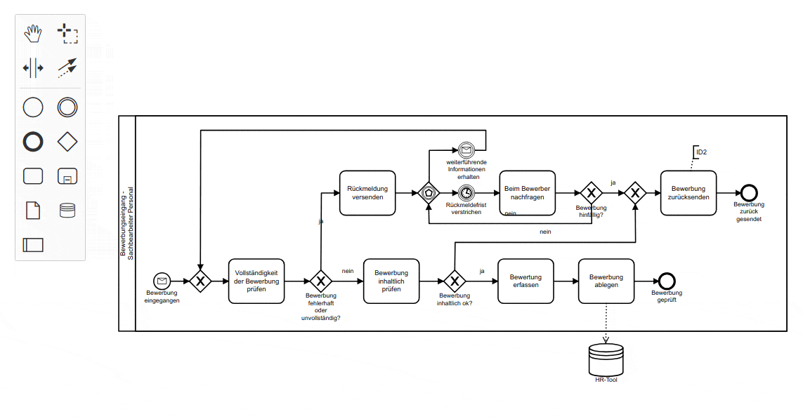
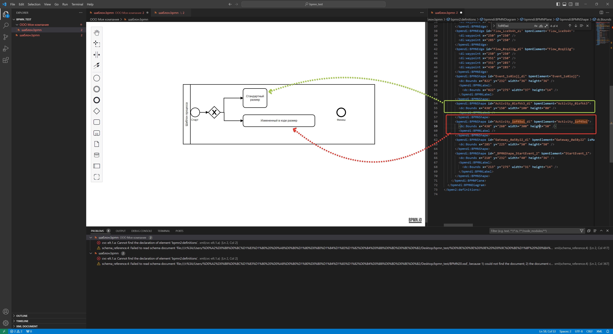

# Инструкция по установке инструментов, описанию и выгрузке бизнес-процессов

Данная инструкция предназначена для участников рабочей группы проекта по описанию сквозного процесса жизненного цикла объекта капитального строительства и модели данных объекта капитального строительства в целях унификации инструментов, форматов и подходов к разработке бизнес процессов, разрабатываемых в рамках проекта.

## Содержание

1. [Установка инструментов для моделирования бизнес-процессов](#установка-инструментов-для-моделирования-бизнес-процессов)
2. [Общее описание функций инструмента для моделирования бизнес-процессов](#описание-функционала-bpmnio)
3. [Требования к нотации для описания бизнес-процессов](#правила-оформления-моделей-бизнес-процессов)
4. [Проверка корректности с использованием инструментов симуляции]()
5. [Передача моделей бизнес-процессов в общий репозиторий с использованием Git]()

## Установка инструментов для моделирования бизнес-процессов

Для работы по описанию бизнес процессов потребуется персональный компьютер с доступом в сеть интернет, для которого потребуется установка следующих приложений:

1. "Microsoft Visual Studio Code" (или VSC) - бесплатный редактор кода
2. Надстройка (плагин) к VSC "BPMN.io" для описания бизнес-процессов
3. Программа "Git" - для контроля версий и передачи в общий репозиторий

> Описываемые в настоящей инструкции шаги выполняются на примере работы с операционной системой Windows, как наиболее распространенной. Установка представленных инструментов на операционные системы Linux допускается, однако в настоящей инструкции отдельно не рассматривается.

### Установка Microsoft Visual Studio Code (VSC)

**Microsoft Visual Studio Code** является бесплатным приложением, разработанным компанией Microsoft, для работы с программным кодом и преимущественно для разработчиков программного обеспечения. Однако наличие в нем большой библиотеки расширений позволяет значительно расширить возможности использования, в том числе для специалистов широкого профиля.
Для установки Microsoft VSC необходимо перейти в раздел **Download** на [официальном сайте программы](https://code.visualstudio.com/Download) и скачать подходящую для вашей операционной системы версию.


После завершения скачивания программу необходимо установить на ваш рабочий компьютер.

> Для установки приложений вам потребуются права администратора.

В процессе установки программы, необходимо убедиться, что отмечен пункт *"Добавить в PATH"*. Остальные параметры отмечаются по необходимости.


После установки рекомендуется перезагрузить ПК в целях обновления системной информации и корректной работы программы.
Запуск программы осуществляется с ярлыка на рабочем столе или из перечня программ в меню "Пуск".


### Установка плагина BPMN.io

**BPMN.io** - проект свободно распространяемых графических инструмент для моделирования различного типа моделей и схем (BPMN, DMN и др.). Используется в качестве основного движка в системе управления бизнес-процессов Camunda. Его графическая подсистема **bpmn-js** может встраиваться в любые виды настольных (десктоп) и веб-приложений. но также встречается и в виде надстроек для программ, в том числе для Microsoft VSC.
Главным преимуществом использования bpmn-js, как плагина к VSC, является возможность правки схемы непосредственно в коде модели бизнес-процесса, т.к. описание происходит на языке разметки XML. Это позволяет расширить недоступный функционал при моделировании бизнес-процессов.
Подробнее о проекте BPMN.io вы можете узнать на его [официальном сайте](https://bpmn.io/).



Для установки плагина BPMN.io на VSC необходимо сделать следующее:

1. В левой панели VSC выбрать раздел "Extensions" (или нажать на комбинацию клавиш Ctrl+Shift+X)
2. В появившемся блоке в верхнем поле "Search Extensions in Marketplace" необходимо ввести `bpmn.io Editor`
3. Из найденных вариантов выбрать BPMN.io Editor, где в правом углу необходимо выбрать команду "Install" для установки плагина


### Установка приложения GIT

**GIT** - система контроля версий программного кода. Повсеместно используется командами разработчиков по всему миру для совместной разработки программного обеспечения. Позволяет отслеживать изменения, контроллировать ход разработки и при необходимости возвращаться к предыдущим версиям кода.

> Важно знать о разнице между **GIT** и **GITHUB**: GIT - это программа, устанавливаемая на компьютер, и работающая с локальным репозиторием (т.е. директорией, в которой вы храните код и файлы), а GITHUB, или его отечественный аналог GitFlic - это удаленный репозиторий для возможности совместной работы удаленных команд. Именно через удаленный репозиторий происходит передача и получение информации. Работа на удаленном репозитории без Git, установленном на вашем компьютере, невозможна.

Для обмена информацией при разработке бизнес-процессов будет использоваться удаленный репозиторий на отечественной платформе **GitFlic**. О процессе работы с удалённым репозиторием описано в соответствующем разделе данной инструкции. Однако, для работы с ним, обязательно необходимо скачать и установить саму программу Git. Для этого перейдите на [официальный сайт приложения](https://git-scm.com/downloads "Git") и скачайте подходящую для вашей ОС версию.


В процессе установки система будет запрашивать множество настроек. При отсутствии соответствующей необходимости, следует оставить эти настройки по умолчанию, нажимая только кнопку "Next" (далее) вплоть до начала процесса установки.


GIT - приложение консольное, т.е. у него отсутствует графическая оболочка. Поэтому для того, чтобы убедиться, что GIT установлен, достаточно открыть командную строку (Win+R и ввести "cmd"), ввести команду

```
git --version
```

Если в ответ вы получите

```
git version 2.42.0.windows.2
```

Это означает, что программа установлена корректно (версия может отличаться, но главное, что она отображается)


### Настройка VSC для работы с BPMN.io

Для того, чтобы работать в BPMN.io внутри Visual Studio Code, необходимо

1. Выбрать меню File -> Open Folder и в открывшемся окне выбрать папку, в которой у вас будет храниться ваш файл бизнес-процесса. Для примера это будет папка с именем **bpmn_test**

> В данную папку будет клонирован репозиторий с GitFlic, откуда вы возьмете шаблон для разработки бизнес-процесса, поэтому в примере в выбранной папке уже есть файл. Подробнее по работе с репозиторием описано в соответствующем разделе инструкции.

После того, как вы выберете папку, может появиться окошко с предупреждением о том, что данная папка не является доверенной, в связи с чем необходимо подтвердить, что вы ей доверяете, нажав на команду *"Yes, I trust the authors" (Да, я доверяю авторам).*


2. Перейдите в раздел Explorer в левой части окна программы и наведите на строку с именем только что открывшейся папки, в результате чего появятся скрытые кнопки, и выберете соответствующую кнопку в интерфейсе: создайте папку, где вы будете вести вашу схему процесса и дайте ей имя, соответствующее, например, имени вашей компании.


3. Теперь необходимо скопировать шаблон файла бизнес-процесса в вашу папку. Это можно сделать как стандартными средствами в окне проводника, так и в том же окне VSC, вызвав контекстное меню по шаблону и выбрав команду "Сopy", а затем выбрав новую папку, и вызвав контекстное меню выбрать команду "Paste". При необходимости только что созданную копию можно переименовать, выбрав в контекстном меню команду "Rename...".


4. После того, как копия создана, нажмите на неё. В основном окне программы откроется графический редактор bpmn.io в котором будет происходить основная работа по описанию бизнес-процесса.


5. Для удобства редактирования можно параллельно с графическим интерфейсом открыть тот же файл в текстовой форме. Для этого необходимо:

   1. Нажать правой кнопкой мыши по вкладке открытого файла и выбрать команду "Reopen Editor With", и в появившемся меню выбрать команду "Text Editor".

   

   2. Теперь необходимо выбрать команду "Split Editor Right" в правой верхней части окна, что позволит разделить окно на две части.

   

   3. Снова нажать правой кнопкой мыши по вкладке, например слева, выбрать команду "Reopen Editor With", и в появившемся окне меню выбрать команду "BPMN Modeller". В результате отобразится 2 вкладки с одним и тем же файлом, но в разных формах отображения.

   

> Для того, чтобы изменения отражались в соседнем окне, необходимо сохранять файл, используя, например, комбинаци. клавиш Ctrl+S. При сохранении файла, все изменения тут же отобразятся в его текстовом представлении (правая вкладка).

#### Для чего использовать код (текстовое представление)?

Самый простой пример - изменение размеров графических элементов. По умолчанию графические инструменты bpmn.io не дают возможности растянуть некоторые элементы, например блоки действий (Activities). Из-за этого невозможно уменьшить или увеличить блоки действий. Однако, если найти данный элемент в текстовом представлении, и изменить параметры его размеров (width - ширина и height - высота) в графическом представлении элемент также изменит значение.



### Camunda Modeller - альтернатива VSC + BPMN.io

Если по какой-либо причине установить VSC в связке с плагином bpmn.io невозможно, можно использовать бесплатное десктопное приложение "Camunda modeller", которое можно скачать с [официального сайта](https://camunda.com/download/modeler/) приложения.


После установки, приложение будет доступно из меню Пуск по имени "Camunda Modeller". Открыв приложение и открыв в нем схему bpmn, можно использовать те же самые инструменты для описания бизнес-процесса.


## Описание функционала bpmn.io

> **ВНИМАНИЕ**
>
> Настоящее описание не является полноценным исчерпывающим руководством, однако достаточно для того, чтобы ознакомиться с основными функциями для моделирования бизнес-процессов.

### Общий обзор интерфейса

Основными элементами интерфейса в графическом редакторе описания бизнес-процессов bpmn.io являются:

* рабочая область - в ней размещается сама схема (модель) бизнес-процесса
* панель инструментов - в ней размещаются необходимые для работы инструменты: инструменты панорамирования, группового выделения, растягивания схемы, а также все основные элементы нотации BPMN 2.0


### Описание инструментов

#### Рука

**Рука** используется при необходимости панорамирования схемы в плоскости. Для этого необходимо выбрать инструмент и зажав левую кнопку мыши перемещать в стороны.


#### Групповое выделение

Групповое выделение элементов позволяет выбрать все или часть элементов схемы для того, чтобы, например, сдвинуть их. Для этого выбрав инструмент, нужно зажав левой кнопкой мыши создать область, в которую попадут выбираемые элементы. После чего можно, например, их переместить.


#### Растяжение схемы

Использование инструмента растяжения позволяет растянуть всю рабочую область по горизонтали или вертикали. Это может быть полезно, когда необходимо увеличить место для добавления новых элементов, или напротив - сокращения занимаемого места. Для этого необходимо выбрать инструмент, навести на место в рабочей области, где будет происходить растяжения, а затем, зажав  левую кнопку мыши, переместить в нужную сторону.


#### Добавление потоков

Использование инструмента потока (стрелок) позволяет соединять два отдельных элемента. Возможно два метода: при выборе из панели инструментов и при высплывающем меню у элемента. В первом случае нужно выбрать инструмент на панели, выбрать первый элемент, а затем второй. Во втором случае, необходимо выбрать первый элемент и во всплывающем меню выбрать иконку со стрелками (потоками) и уже затем выбрать соединяемый элемент.


#### Изменение потоков

Потоки (стрелки), размещаемые на схеме, можно изменять, используя маркеры параллельного перемещения (расположены на линиях потоков) и маркеры свободного перемещения (расположены на краях потоков).


#### Копирование и вставка элементов

При необходимости скопировать элементы схемы, следует использовать комбинацию горячих клавиш: Ctrl+C (копировать) и Ctrl+V (вставить).


> Данный способ работает только в пределах одного файла модели бизнес-процесса. Скопировать в одном, а потом вставить в другой файл не получится.
>
> В Camunda Modeller данный способ недоступен.

#### Размещение элементов схемы

Для того, чтобы разместить элемент на схеме, воспользуйтесь одним из двух методов:

1) Нажатием на команду на панели инструментов: при нажатии на иконку команды и выбором места в рабочей области
2) Нажатием на команду из всплывающего меню на элементе выбрать элемент, создаваемый в потоке за выбранным.


#### Изменение текста элементов

Для добавления текста к элементу следует щелкнуть по нему двойным щелчком мыши. Активируется текстовое поле, вводится текст и подтверждается нажатием на *Enter* с клавиатуры.


#### Изменение типов элементов схемы

Изменить тип элементов схемы можно выбрав элемент и во всплывающем меню нажав (при наличии) на команду с иконкой гаечного ключа. В рамкрывшемся меню можно выбрать новый тип элемента.


#### Удаление элементов схемы

Для удаления выбранных элементов необходимо выбрать иконку корзины на всплывающем меню выбранного элемента, либо нажатием на клавишу Delete с клавиатуры.


#### Вставка элементов в поток

При необходимости вставить дополнительный элемент между другими, если они уже объединены потоком (стрелкой), необходимо выбрать элемент (например из панели инструментов) и поставить его поверх потока (стрелки).


#### Изменение цвета элементов

Для того, чтобы изменить цвет любого элемента, необходимо выбрать элемент и во всплывающем меню нажать на команду с иконкой кисточки. В выпадающем меню выбрать подходящий цвет.


#### Добавление комментариев к схеме

Для добавления комментария, он должен быть привязан к одному из элементов схемы. Для этого выбирается элемент и во всплывающем меню выбирается командау с иконкой обозначнеия комментария. После чего посредством функции [изменения текста](#изменение-текста-элементов) добавляется комментарий, а затем размещается в удобном положении.


#### Пулы, дорожки и операции с ними

Для добавления пула необходимо выбрать соответствующую команду на панели инструментов. Пул можно разделять, добавлять новые дорожки и изменять их заголовки. Кроме того, пул может быть разделен таким образом, что он будет как встроенный (пул нижнего уровня.) Для этого необходимо выбрать не сам пул, а дорожку, которую при разделении станет встроенным пулом.


#### Группы

Для использования групп достаточно выбрать соответствующий инструмент на панели и установить в рабочей области. Затем, используя маркеры растяжения, выровнять размеры и разместить в удобном месте.


## Правила оформления моделей бизнес-процессов

Настоящий раздел определяет правила, которых необходимо придерживаться при разработке моделей бизнес-процессов.

### Нотация BPMN 2.0

Основным "языком" описания бизнес-процессов для целей проекта является система условных обозначения (нотация) BPMN версии 2.0. Данная нотация разрабатывается и поддерживается консорциумом [Object Management Group](https://www.omg.org/). На официальном [сайте нотации BPMN](https://www.bpmn.org/) есть официальное англоязычное руководство, примеры моделей процессов и другие полезные сведения.

Тем не менее, существует большое количество русскоязычных источников, которые можно использовать для изучения работе с BPMN. Вы можете найти их, используя любую поисковую систему, вот лишь некоторые из них:

* Справочник по BPMN 2.0 - [https://camundarus.ru/bpmn/reference](https://camundarus.ru/bpmn/reference)
* Справочник элементов BPMN с примерами - [https://stormbpmn.com/bpmn/elements/](https://stormbpmn.com/bpmn/elements/)
* Нотация BPMN 2.0: ключевые элементы и описание - [https://www.comindware.ru/blog/нотация-bpmn-2-0-элементы-и-описание/](https://www.comindware.ru/blog/нотация-bpmn-2-0-элементы-и-описание/)
* Базовый видеокурс по BPMN от Рамиля Кинзябулатова - [https://youtube.com/playlist?list=PLysJcIFsyXNIn4YN-bL8qAS6W4D1avmhp&amp;si=zkAOvJdwVauMGf7x](https://youtube.com/playlist?list=PLysJcIFsyXNIn4YN-bL8qAS6W4D1avmhp&si=zkAOvJdwVauMGf7x)

> Указанные источники взяты из первых результатов поискового запроса "bpmn 2.0 Инструкция" и не являются рекламными материалами

Кроме того, можно распечатать [рабочий плакат ](files/BPMN2_0_Poster_RU.pdf)с основными правилами оформления BPMN, элементами и другой полезной информацией, который поможет быстрее ориентироваться при разработке бизнес-процессов. Скачать плакат в полном формате можно также по ссылке [http://bpmb.de/images/BPMN2_0_Poster_RU.pdf](http://bpmb.de/images/BPMN2_0_Poster_RU.pdf)


## Проверка корректности с использованием инструментов симуляции

Проверка разработанных моделей бизнес-процессов с использованием инструментов, использующих графический интерфейс BPMN.io, может производиться с использованием автоматизированных инструментов, которые описываются в настоящем разделе инструкции.

### Симуляция бизнес-процесса с использованием bpmn-js Token Simulation

Симуляция прохождения по процессу является одним из инструментов оценки корректности разработанной модели процесса. Для проведения такой симуляции, как правило, используют токен - виртуальная "фишка", которая перемещается от начала процесса к его окончанию. На некоторых элементах BPMN, например на шлюзах, количество фишек может увеличиваться или уменьшаться. Когда в процессе не осталось фишек, он считается завершенным. Токены помогают «проиграть» будущее исполнение процесса и понять, всё ли правильно нарисовано. При этом, использование токенов на графических схемах процессов используется, как правило, вручную, с использованием вспомогательных инструментов работы с графикой.

При использовании моделей бизнес-процессов, разработанных в BPMN.io, такую симуляцию можно автоматизировать, для чего разработаны специализированные инструменты. Одним из таких инструментов является [bpmn-js Token Simulation](https://github.com/bpmn-io/bpmn-js-token-simulation), свободно распространяемый инструмент, который, по сути, является плагином к движку bpmn.io. Он"читает" процесс и показывает как токен передвигается от начала процесса к его окончанию.


### Как установить инструмент симуляции процессов

На момент написания данной инструкции доступно 2 простых способа установки/использования:

1. Использование демо-площадки проекта [bpmn-js Token Simulation](https://github.com/bpmn-io/bpmn-js-token-simulation) на github
2. Использование плагина к Camunda Modeller

Для использования данного инструмента на демо площадке достаточно перейти на сайт [https://bpmn-io.github.io/bpmn-js-token-simulation/viewer](https://bpmn-io.github.io/bpmn-js-token-simulation/viewer) и "перетащить" туда файл вашей модели бизнес-процесса, после чего активировать команду "Token Simulation" в верхнем левом углу экрана. Чтобы запустить симуляцию, достаточно нажать на команду запуска (иконка с треугольником) на стартовом элементе.


Если же вы в работе используете desktop приложение Camunda Modeller, установка которого [предлагалась ](#camunda-modeller---альтернатива-vsc--bpmnio)в настоящей инструкции, как альтернативный инструмент, можно использовать надстройку (плагин). Для его установки необходимо:

1. Перейти на [репозиторий проекта](https://github.com/camunda/camunda-modeler-token-simulation-plugin) на github
2. Скачать архив основной ветки репозитория выбрав команду "Code" и "Download ZIP" (прямая [ссылка](https://github.com/camunda/camunda-modeler-token-simulation-plugin/archive/refs/heads/main.zip))
3. Распаковать архив в папку плагинов директории Camunda Modeller, которая по умолчанию располагается по пути *~\\[имя папки с Camunda Modeller]\resources\plugins*
4. Запустить программу и проверить, что появился выключатель Token Simulation. Как и в предыдущем случае, чтобы запустить симуляцию, достаточно нажать на команду запуска (иконка с треугольником) на стартовом элементе.


> К сожалению, на текущий момент использование данного симулятора с использованием плагина BPMN.io Editor в VSC недоступно.

### Полезные функции при симуляции процессов.

* Наведя на любой элемент модели бизнес-процесса при включенном Token Simulation, для него можно задать паузу (Add Pause Point), что дает возможность приостановить процесс симуляции на этом элементе до того, как вы вручную не запустите его по команде запуска.
* Используя шлюзы можно выбирать направление движения токена по процессу. Например, при использовании шлюза исключающего "ИЛИ" (ромб с Х), активным является тот поток (стрелка), которая обозначена темным цветом. Неактивные потоки отображаются серым. При этом нажатие на команду с иконкой ветви позволяет изменить активный поток, который будет использоваться при прохождении токена.
* Использование промежуточных событий всегда приостанавливает симуляцию до того, пока вы сами его не запустите.
* Журнал симуляции (располагается на панели под командой Token Simulation) позволяет фиксировать все действия при симуляции в виде перечня.
